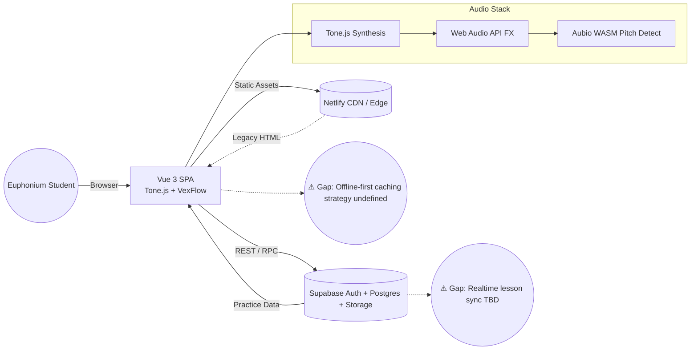
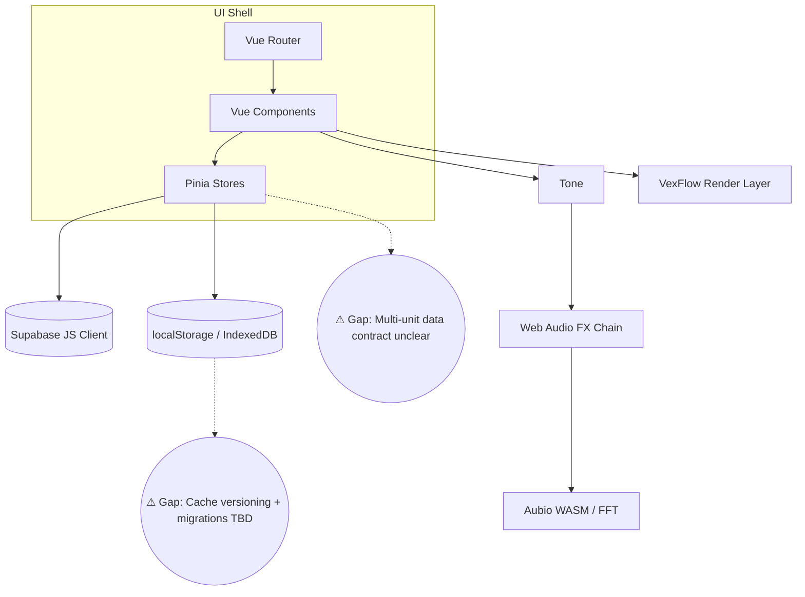
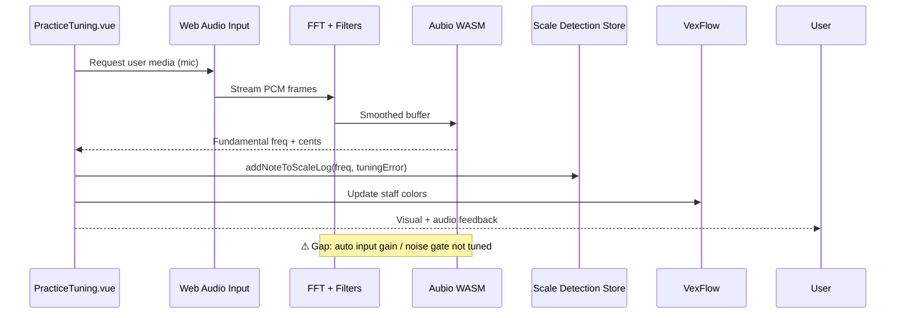

# Music Tutor Studio — Architecture & Diagnostics

> _Use this document as a living diagnostic tool. If a feature cannot be described or diagrammed, mark it with a **⚠ Gap** badge and open a GitHub issue before coding further._

## 1. System Context



### Diagnostic Notes
- **Rendering**: Vue 3 + Vite handles SPA routes (`/alpha`, `/vue-src-alpha`). Legacy static demos still live in `public/`.
- **Audio**: Synth playback (`Tone.js`), analysis (`Web Audio API`, `Aubio WASM`), and visualization (`VexFlow`).
- **Backend**: Supabase (Auth, Postgres, Storage) stores practice units, staff configs, audio clips.
- **Gaps**: Realtime co-practice and offline caching lack clear contracts. Track these before expanding features.

## 2. Frontend Module Map



### Key Flows
| Flow | Description | Status |
|------|-------------|--------|
| Lesson selection | Router loads practice route → Pinia fetches unit → Components hydrate | ✅ Implemented but needs Supabase pagination | 
| Audio playback | Component triggers Tone.js synth preset → Web Audio chain applies FX | ✅ | 
| Pitch detection | Mic input → FFT smoothing → Aubio YIN → scale logger | ✅ (PracticeTuning.vue) |
| Staff rendering | Pinia note array → `StaffPreview.vue` → VexFlow SVG | ✅ |
| Offline cache | `localStorage` for prefs only | ⚠ Gap |
| Multi-user sync | No realtime / activity feed | ⚠ Gap |

## 3. Audio Pipeline (Mic + Synth)



### Audio Diagnostic Checklist
- [x] Tone.js synth presets load per instrument.
- [x] Web Audio chain clamps frequencies 40–8,000 Hz.
- [ ] ⚠ Input gain staging auto-calibration.
- [ ] ⚠ Noise gate threshold per instrument family.
- [ ] ⚠ Latency budget benchmark on low-end devices.

## 4. Backend & Data Contracts

```mermaid
graph LR
  subgraph Supabase
    Auth[(Auth)]
    DB[(Postgres)]
    Storage[(Storage)]
  end

  Auth --> Tokens
  Tokens --> VueApp[Vue App]
  VueApp --> DB: practiceUnitHeader, noteArray, analytics
  VueApp --> Storage: audio snapshots, uploads
  DB --> ETL[(Analytics Export)]

  DB -.-> GapPermissions((⚠ Gap: Row Level Security for ensembles))
  Storage -.-> GapCleanup((⚠ Gap: Expired audio cleanup job))
```

### Tables & Contracts
| Table | Fields | Notes |
|-------|--------|-------|
| `practice_units` | metadata, owner_id, timestamps | ✅ Defined in `supabase-schema.sql` |
| `practice_unit_notes` | FK → unit, note array JSONB | ✅
| `practice_sessions` | user_id, unit_id, tuning deltas | ⚠ Spec missing |
| `audio_snapshots` | path, user_id, octave range | ⚠ Cleanup + quota undefined |

## 5. Gap Tracker

| Gap | Description | Proposed Action |
|-----|-------------|-----------------|
| ⚠ Realtime lesson sync | No strategy for multiple students in same practice room | Draft Supabase channel plan → [Open issue](https://github.com/dangarlen/MusicTutorStudio/issues/new?title=Realtime%20lesson%20sync%20plan) |
| ⚠ Offline-first cache | Only cookies/localStorage for prefs; scale data rebuilt every load | Evaluate Workbox + IndexedDB caching → [Open issue](https://github.com/dangarlen/MusicTutorStudio/issues/new?title=Offline%20cache%20strategy) |
| ⚠ Multi-unit data contract | `multiUnitDataStoreRoadMap.md` incomplete | Finalize schema + sharing rules |
| ⚠ Input gain calibration | Auto gain / noise handling TBD | Prototype calibration wizard |
| ⚠ Row-level security | Ensemble sharing rules unspecified | Extend Supabase RLS policies |

## 6. Next Steps
1. Confirm `/docs` VitePress scaffolding so this file becomes part of published docs.
2. Convert gap rows into GitHub issues and link IDs for traceability.
3. For every new feature PR, update this doc and add diagrams/tests before merge.

---
Need help interpreting a flow? Tag this doc in GitHub discussions and keep the ⚠ markers up to date.
